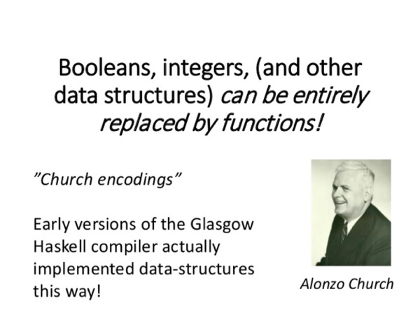
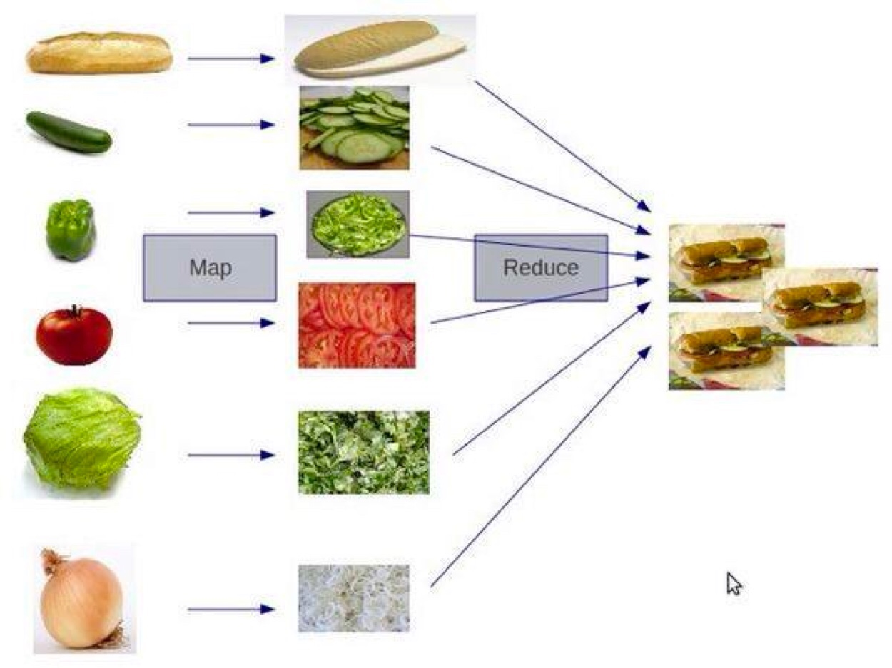

# 函数式编程

在程序世界中，编程工作更多的是解决业务上的问题，而不是计算机的问题，我们需要更为贴近业务更为抽象的语言，如面向对象语言 C++ 和 Java 等。

然而，如何做更为抽象的泛型呢？答案就是函数式编程（Functional Programming）。

相对于计算机的历史而言，函数式编程其实是一个非常古老的概念。函数式编程的基础模型来源于 λ 演算，而 λ 演算并非设计于在计算机上执行。它是由 Alonzo Church 和 Stephen Cole Kleene 在 20 世纪 30 年代引入的一套用于研究函数定义、函数应用和递归的形式系统。

如 Alonzo 所说，像 booleans、integers 或者其他的数据结构都可以被函数取代掉。

函数式编程借用的理念就是数学的代数
```python
f(x)=5x^2+4x+3
g(x)=2f(x)+5=10x^2+8x+11
h(x)=f(x)+g(x)=15x^2+12x+14
```
除了定义上述n元函数还可以递归，例如老生常谈的斐波拉契数列：
```python
f(x)=f(x-1)+f(x-2)
```
函数式编程只关心定义输入数据和输出数据相关的关系，数学表达式里面其实是在做一种**映射**（mapping），输入的数据和输出的数据关系是什么样的，是用函数来定义的。
## 特征
* **stateless**：函数不维护任何状态。函数式编程的核心精神是 stateless，简而言之就是它不能存在状态，你给我数据我处理完扔出来，里面的数据是不变的。
* **immutable**：输入数据是不能动的，动了输入数据就有危险，所以要返回新的数据集。

```python
// 非函数式，不是 pure funciton，有状态
int cnt;
void increment(){
    cnt++;
}
```
```python
// 函数式，pure function， 无状态
int increment(int cnt){
    return cnt+1;
}
```

## 优势
* 没有状态就没有伤害。
* 并行执行无伤害。
* Copy-Paste 重构代码无伤害。
* 函数的执行没有顺序上的问题。

## 好处
* **惰性求值** 这需要编译器的支持。表达式不在它被绑定到变量之后就立即求值，而是在该值被取用的时候求值。
* **确定性** 所谓确定性，就是像在数学中那样，f(x) = y 这个函数无论在什么场景下，都会得到同样的结果。

## 劣势
* 数据复制比较严重。(影响性能？)
* **思维不习惯**，因为函数式编程和过程式编程的思维方式完全不一样。过程式编程是在把具体的流程描述出来，所以可以不假思索，而函数式编程的抽象度更大，在实现方式上，函数套函数，函数返回函数，函数里定义函数……把人搞得很糊涂。

函数式编程用到的技术
* **first class function（头等函数）** ：这个技术可以让你的函数就像变量一样来使用。也就是说，你的函数可以像变量一样被创建、修改，并当成变量一样传递、返回，或是在函数中嵌套函数。（python里面函数的各种玩法大家司空见惯）

* **tail recursion optimization（尾递归优化）** ： 我们知道递归的害处，那就是如果递归很深的话，stack 受不了，并会导致性能大幅度下降。因此，我们使用尾递归优化技术——每次递归时都会重用 stack，这样能够提升性能。当然，这需要语言或编译器的支持。Python 就不支持。

* **map & reduce**：这个技术不用多说了，函数式编程最常见的技术就是对一个集合做 Map 和 Reduce 操作。这比起过程式的语言来说，在代码上要更容易阅读。

* **pipeline（管道）**：这个技术的意思是，将函数实例成一个一个的 action，然后将一组 action 放到一个数组或是列表中，再把数据传给这个 action list，数据就像一个 pipeline 一样顺序地被各个函数所操作，最终得到我们想要的结果。
* **recursing（递归）** ：递归最大的好处就简化代码，它可以把一个复杂的问题用很简单的代码描述出来。注意：递归的精髓是描述问题，而这正是函数式编程的精髓。
* **higher order function（高阶函数）**：所谓高阶函数就是函数当参数，把传入的函数做一个封装，然后返回这个封装函数。现象上就是函数传进传出，就像面向对象对象满天飞一样。这个技术用来做 Decorator 很不错。
* **currying（柯里化）** ：将一个函数的多个参数分解成多个函数， 然后将函数多层封装起来，每层函数都返回一个函数去接收下一个参数，这可以简化函数的多个参数。例子如下：
```python
def inc(x):
    def incx(y):
        return x+y
    return incx
 
inc2 = inc(2)
inc5 = inc(5)
 
print inc2(5) # 输出 7
print inc5(5) # 输出 10
```

## 函数式语言的三套件
函数式语言有三套件，**Map**、**Reduce** 和 **Filter**。下面我们来看一下 Python 语言中的一个示例。这个示例的需求是，我们想把一个字符串数组中的字符串都转成小写。

用常规的面向过程的方式，代码如下所示：
```python
# 传统的非函数式
upname =['SHARE', 'PROGAME', 'PARADIGM']
lowname =[] 
for i in range(len(upname)):
    lowname.append( upname[i].lower() )
print lowname
```
```python
# 函数式
def toLower(item):
      return item.lower()
 
lower_name = map(toLower, ['SHARE', 'PROGAME', 'PARADIGM'])
 
print lower_name
# 输出 ["share", "program", "paradigm"]
```
如果觉得上述的例子还是指令式编程比较好懂，我们看看下面的求平均数：
```python
num =  [2, -5, 9, 7, -2, 5, 3, 1, 0, -3, 8]
positive_num_cnt = 0
positive_num_sum = 0
for i in range(len(num)):
    if num[i] > 0:
        positive_num_cnt += 1
        positive_num_sum += num[i]
 
if positive_num_cnt > 0:
    average = positive_num_sum / positive_num_cnt
 
print average
```
```python
# 计算数组中正数的平均值
num =  [2, -5, 9, 7, -2, 5, 3, 1, 0, -3, 8]
positive_num = filter(lambda x: x>0, num)
average = reduce(lambda x,y: x+y, positive_num) / len( positive_num )
```
上述代码变成了在描述你要干什么，而不是怎么干。
## pipeline
一个数组取偶数乘以3再逐个打印字符串的例子
```python
def even_filter(nums):
    for num in nums:
        if num % 2 == 0:
            yield num
def multiply_by_three(nums):
    for num in nums:
        yield num * 3
def convert_to_string(nums):
    for num in nums:
        yield 'The Number: %s' % num

nums = [1, 2, 3, 4, 5, 6, 7, 8, 9, 10]
pipeline = convert_to_string(multiply_by_three(even_filter(nums)))
for num in pipeline:
    print num
# 输出：
# The Number: 6
# The Number: 12
# The Number: 18
# The Number: 24
# The Number: 3
```
好像不够pipline的感觉，可以利用force函数和装饰器再搞一下：
```python
class Pipe(object):
    def __init__(self, func):
        self.func = func
 
    def __ror__(self, other):
        def generator():
            for obj in other:
                if obj is not None:
                    yield self.func(obj)
        return generator()
 
@Pipe
def even_filter(num):
    return num if num % 2 == 0 else None
 
@Pipe
def multiply_by_three(num):
    return num*3
 
@Pipe
def convert_to_string(num):
    return 'The Number: %s' % num
 
@Pipe
def echo(item):
    print item
    return item
 
def force(sqs):
    for item in sqs: pass
 
nums = [1, 2, 3, 4, 5, 6, 7, 8, 9, 10]
 
force(nums | even_filter | multiply_by_three | convert_to_string | echo)
```
## 高阶函数（装饰器）
装饰器语法糖：
```python
@decorator
def func():
    pass
```
解释器里面是这样解释：
```python
func = decorator(func)
```
可以看看这个斐波拉契加缓存的代码：
```python
from functools import wraps
def memoization(fn):
    cache = {}
 
    @wraps(fn)
    def wrapper(*args):
        result = cache.get(args)
        if not result:
            result = fn(*args)
            cache[args] = result
        return result
 
    return wrapper

@memoization
def fib(n):
    if n < 2:
        return n
    return fib(n - 1) + fib(n - 2)
```
## 小结
相对于计算机发展史，函数式编程是个非常古老的概念，它的核心思想是将运算过程尽量写成一系列嵌套的函数调用，关注的是做什么而不是怎么做，因而被称为声明式编程。
